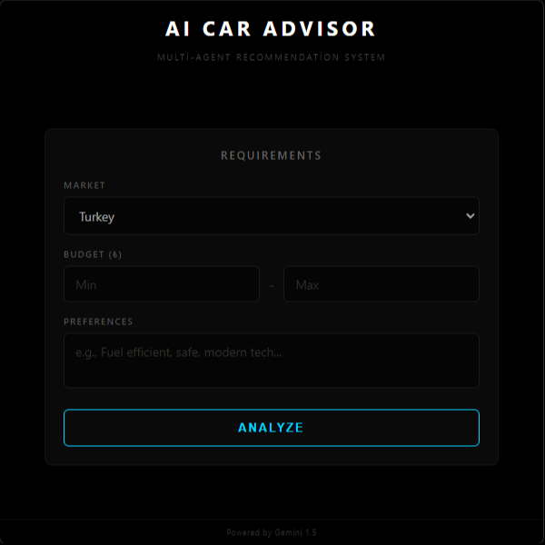

<div align="center">
  <h1>CAR ADVISOR AI</h1>
  
  <p>
    <b>🤖 Multi-agent car recommendation system powered by Google Gemini AI for the automotive market.</b>
  </p>
  
  <br>
  
  
</div>

## ✨ What It Does

Enter your budget and preferences, and watch as **6 specialized AI agents** compete to find you the perfect car. Each agent represents a different market segment and advocates for their brands. A **jury AI** evaluates all recommendations and crowns the ultimate winner based on performance, safety, value, and your needs.

**Think of it as:** A panel of expert car salespeople debating which car is best for you - but faster, unbiased, and powered by AI.

## 🛠️ Tech Stack

- **Backend:** ASP.NET Core 8.0 🔧
- **Frontend:** React 18 ⚛️
- **Desktop:** Electron 28 🖥️
- **AI:** Google Gemini 2.0 Flash 🧠

## 📦 Setup

### Prerequisites
- .NET 8.0 SDK
- Node.js 18+
- Google Gemini API Key 🔑

### Installation

1. 📥 Clone the repository
2. 🔐 Add your Gemini API key to `appsettings.json`:
```json
{
  "GeminiApiKey": "YOUR_API_KEY_HERE"
}
```
3. 🏗️ Build
   - Use `Electron-Build.txt` for full build instructions

## 🏛️ Architecture

**6 Specialized Agents:**
- 💎 Ultra-Luxury (Porsche, Bentley, Ferrari)
- ⭐ Premium (BMW, Mercedes, Audi)
- 🎯 Upper-Mainstream (VW, Mazda, Subaru)
- 🔧 Mainstream (Toyota, Honda, Hyundai)
- 💸 Budget (Dacia, Fiat, Renault)
- ⚡ Electric (Tesla, BYD, Polestar)

Each agent analyzes the market, recommends 2-3 cars with detailed specs, and argues why their picks are best.

**Jury System:** 🏆 The final AI jury scores each car on 8 criteria (performance, safety, comfort, tech, value, fuel economy, market fit, client match) and declares the winner.
